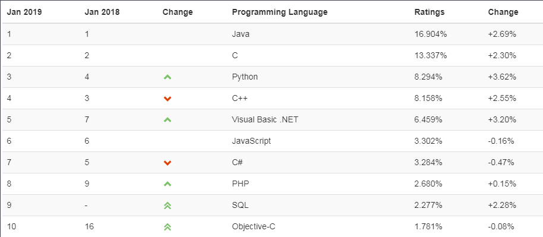

# 了解Java

&ensp;&ensp;&ensp;&ensp;当我在学习js的时候，并没有去认真的了解js的起源以及js的发展历程等等，当时只知道要做前端必须要学会使用js。所以为了成为一个前端，我去学习了html，css，js等等。现在看来，我方式并非是对js语言感兴趣，而是对当时日渐火热的前端岗位感兴趣。

&ensp;&ensp;&ensp;&ensp;当然，这次学习Java语言也不是对语言本身有多大兴趣，而是

再看看各大招聘网站的Java岗位数量和平均薪资。

Java还是稳啊！还了解什么啊，赶快学啊！

&ensp;&ensp;&ensp;&ensp;还是了解一下比较好。

#### 什么是Java语言 

&ensp;&ensp;&ensp;&ensp;Java语言是美国Sun公司（Stanford University Network），在1995年推出的高级的编程语言。所谓编程语言，是 计算机的语言，人们可以使用编程语言对计算机下达命令，让计算机完成人们需要的功能。 

#### Java语言发展历史 

- 1995年Sun公司发布Java1.0版本 
- 1997年发布Java 1.1版本 
- 1998年发布Java 1.2版本
- 2000年发布Java 1.3版本 
- 2002年发布Java 1.4版本
- 2004年发布Java 1.5版本 
- 2006年发布Java 1.6版本
- 2009年Oracle甲骨文公司收购Sun公司，并于2011发布Java 1.7版本 
- 2014年发布Java 1.8版本 
- 2017年发布Java 9.0版本 

#### Java能做什么

&ensp;&ensp;&ensp;&ensp;能帮你提高薪资。

