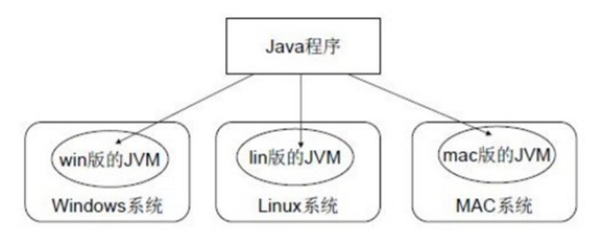
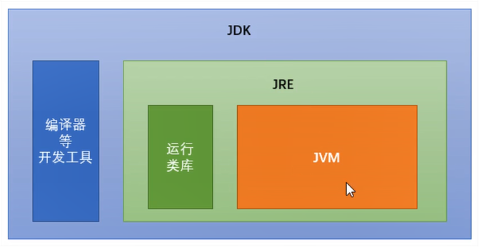
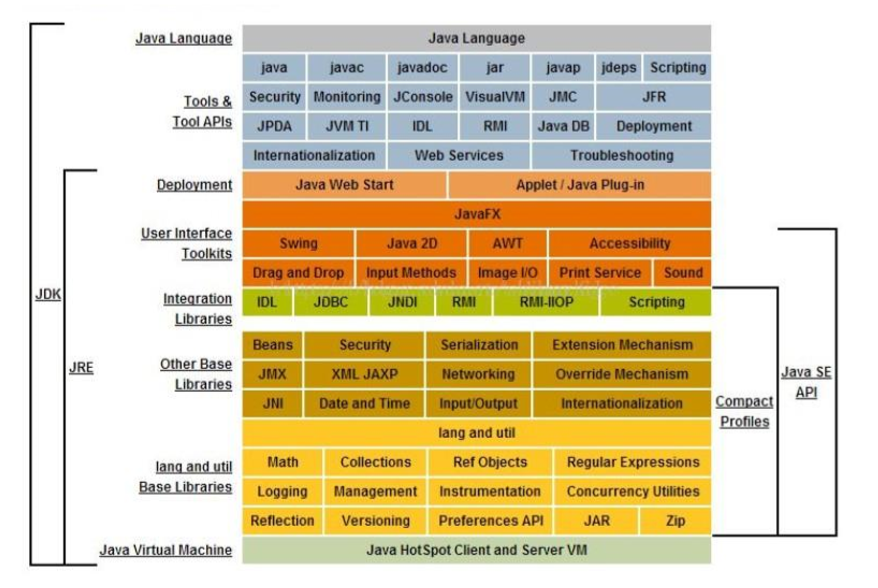

# 第2节：Java环境

&ensp;&ensp;&ensp;&ensp;众所周知，前端代码是运行在浏览器环境中，想要看到前端的页面，必须要到浏览器中打开对应的页面。现在的桌面应用和app等，本质上是两种方法在运行前端代码，一是：框架把前端代码翻译成底层的原生代码，如RN等；二是：把浏览器内核封装在应用中，如一些桌面应用程和H5+等。

&ensp;&ensp;&ensp;&ensp;跟前端代码一样，Java运行也是需要环境的。通俗的讲，Java代码需要使用JVM虚拟机来运行Java代码。所以Java代码是运行在JVM中的，就像前端代码运行在浏览器环境中一样。

&ensp;&ensp;&ensp;&ensp;那JVM是什么呢，因为水平有限，我只能通过类比，简单的描述一下。对前期的学习应该够用了。

&ensp;&ensp;&ensp;&ensp;JVM和浏览器内核一样，都是运行代码的环境。我们在使用浏览器的时候，是需要安装的，JVM也一样。JVM有各个系统对应的版本，如windows、lin、mac

这样Java就可以跨平台运行在各种系统中。但是JVM本身不具备跨平台功能的，每个操作系统下都有不同版本的JVM，这才让Java可以跨平台运行。 

&ensp;&ensp;&ensp;&ensp;但是光有JVM不行，就像光有浏览器内核也不行一样。所以我们需要更高集成度的环境。

- **JRE** (Java Runtime Environment) ：是Java程序的运行时环境，包含JVM和运行时所需要的核心类库。 

- **JDK** (Java Development Kit)：是Java程序开发工具包，包含JRE和开发人员使用的工具。


我们想要运行一个已有的Java程序，那么只需安装 ```JRE ```即可。 

我们想要开发一个全新的Java程序，那么必须安装``` JDK``` 。

```JDK ``` > ```JRE ``` > ```JVM ```  , 下图可以了解一下：
