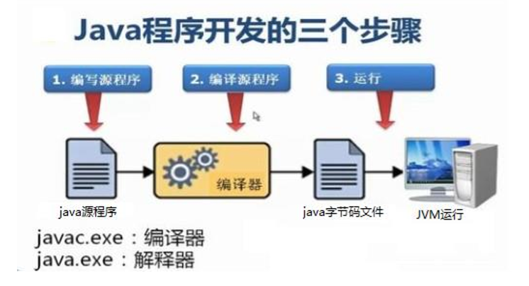
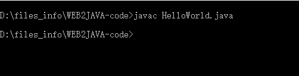
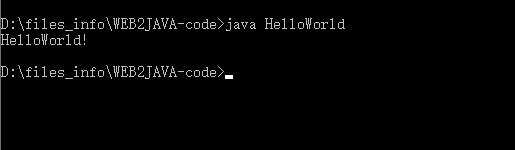

# HelloWorld

&ensp;&ensp;&ensp;&ensp;已经安装好Java环境了，我们来编写第一个Java程序。

&ensp;&ensp;&ensp;&ensp;```HelloWorld.java ```

&ensp;&ensp;&ensp;&ensp;在这之前我们先了解一下Java程序是怎么运行的。前端在编写程序完毕之后，直接在浏览器打开对应的html文件，就能看到渲染出的页面，因为浏览器认识html文档，也能运行js脚本。但是Java程序没有浏览器环境，而且Java的虚拟机JVM并不能直接运行```.java```文件。这里就需要把```.java```文件编译成JVM认识的字节码```.class```文件,然后运行在JVM上。简单的过程如下：


这里的```javac.exe```和```java.exe```，都在安装JDK的bin目录中可以找到。

&ensp;&ensp;&ensp;&ensp;下面我们就来开始写自己的第一个Java程序。因为比较简单，我使用的是Notepad++，当然你也可以使用```sublime```、```vs code```等自己喜欢的编辑器。但是后面都会用到Java语言专门的编辑器。

&ensp;&ensp;&ensp;&ensp;新建一个```.java```文件，文件名为```HelloWorld```，写入下面这段代码：

```java
public class HelloWorld{
    public static void main(String[] args){
        System.out.println("HelloWorld!");
    }
}
```
命令行切换到```HelloWorld.java```文件所在目录下运行：```javac HelloWorld.java```


此时当前目录下多了一个```HelloWorld.class``` 文件，这个文件就是经过```javac.exe```编译过的文件。但是```HelloWorld.java```文件没有被更改，由此可以见编译过程不会对源文件产生影响。

继续输入命令```java HelloWorld```运行编译过的文件，**不需要写后缀名**。


命令行输出``` HelloWorld```,证明程序运行成功！

&ensp;&ensp;&ensp;&ensp;回过头来再看一下之前我们写的Java代码都是什么意思？为什么会输出``` HelloWorld```呢？

```java
//如果学习过es6语法，看到class就会知道这是在声明一个类，Java语言同样是这个意思
//（类的概念前端可能是借鉴Java的）
//类名必须与文件名完全一样
public class HelloWorld{ 
  //在类中声明主方法，每个类必须要有主方法，固定格式写法。这一行就是程序执行的起点。
    public static void main(String[] args){
      //使用System类的打印方法，输出字符串
        System.out.println("HelloWorld!");
    }
}
```

这里有一些概念与前端不一样。对于前端来说，打印输出我们使用的js内置的方法或者叫api(也有其他方法是window下面的方法)。在Java中没有像前端里面的顶级对象，都是内置在JDK中的工具类，``` System```就是其中一个类，我们可以使用这个下面的方法。

类是Java当中所有源代码的基本单位。

在Java中``` '' ```和``` "" ```是有区别的，字符串只能用``` "" ```包裹，后面会学习到的。